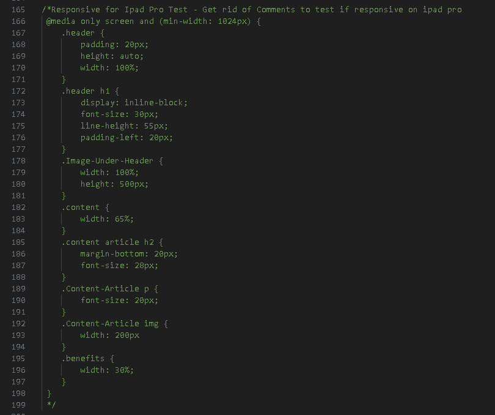
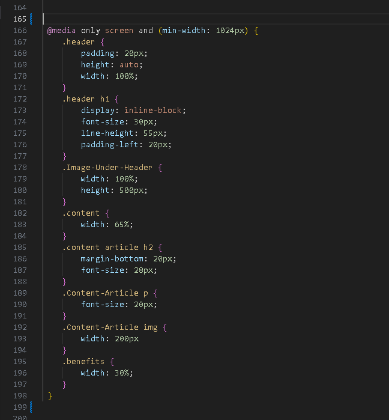
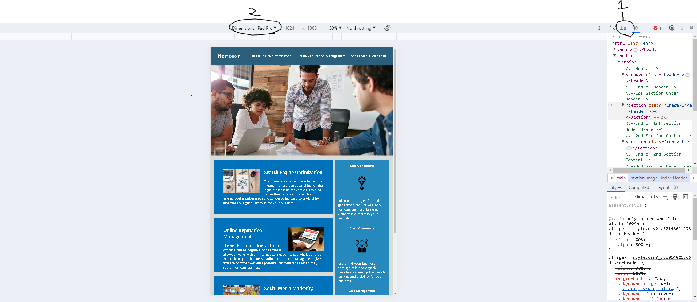

# Code-Refactor-Challenge

## Link to Website

<a href="https://kaleims.github.io/Code-Refactor-Challenge/" target="_blank">Click Here</a>

## Description

 My motivation for this project was to make this webpage more accessible and **functional** by adding, **Semantic Structure** to HTML/CSS and **alt** attributes to anything that may be relevent such as images. I changed the order of the CSS and simplified the code by disposing of any duplicated selectors with the same content, and also added **alt** attributes to images that required a description to add **accessability** to the site for anybody that may be using screen readers. This project taught me a'lot about how HTML should and can be structured to make it easier for yourself and others to read, and lastly I started playing around with **@media** queries to make it more funtional for the Ipad Pro, but this was just test more to this will be explained in 
 [Usage](#usage).

## Installation

N/A

## Usage

Link for the website is located here <a href="https://kaleims.github.io/Code-Refactor-Challenge/" target="_blank">here</a>. **Recommended Brower** would be Chrome as the Ipad Pro can be tested for functionality. To test out the Ipad Pro funtionality you will need to remove the comments for the media queries located in the style.css file. Screenshots will be provided. Remove Line 165 and 199 in the style.css file which is located in assets/css folder images are below. Last set of instructions are at the bottom of the **Usage** section.

 

 
Refer to the picture above. Right click anywhere on the webpage and select inspect element, then refer to the image above and click where the number **1** is located this will open the device tool. And then refer to the image above and click where the number **2** is to open a dropdown box and select **Ipad Pro**. Once you do this, the page will show what it would look like on an Ipad Pro.

## License

MIT License

## Features

- Accessibility
- Functionality
- Semantic Structure
- ↓**Extra**↓ As mentioned in [Usage](#usage)
- @media queries
